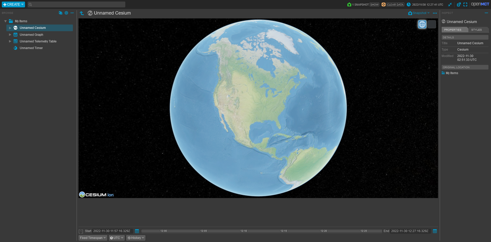

# Cesium OpenMCT Plugin

Example usage in `index.js`.

`yarn install` to install dependencies.

`yarn build` to create a bundle in `./dist`.

`yarn start` to create a devserver with openmct and your plugin.
